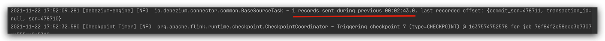
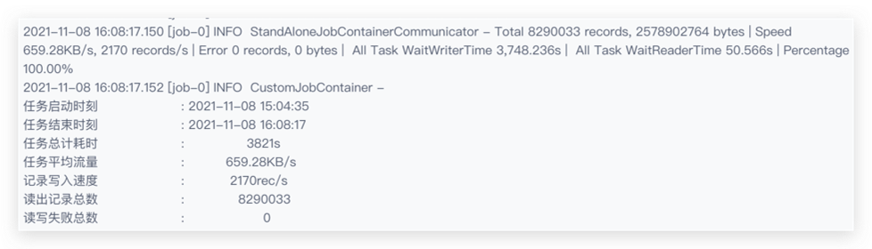
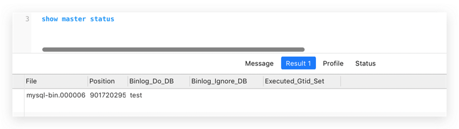
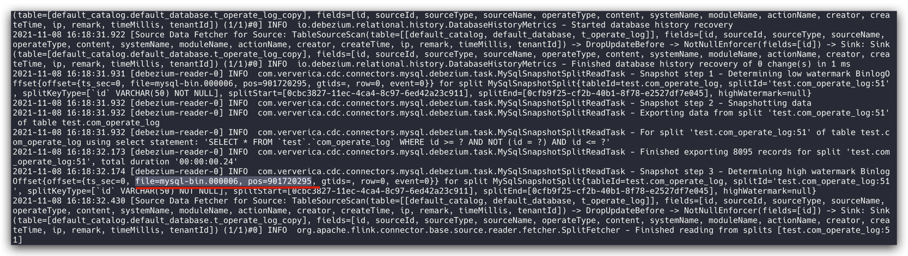
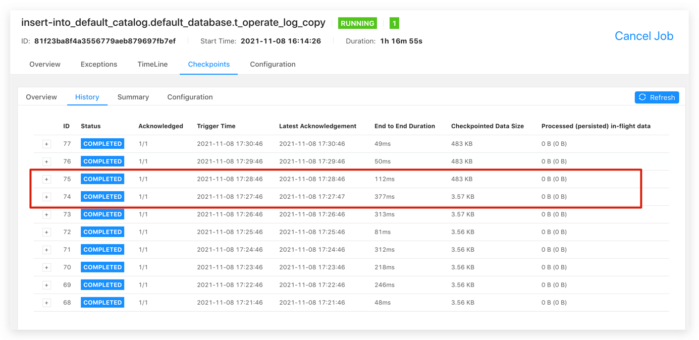
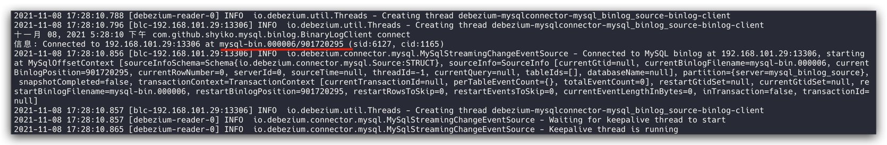
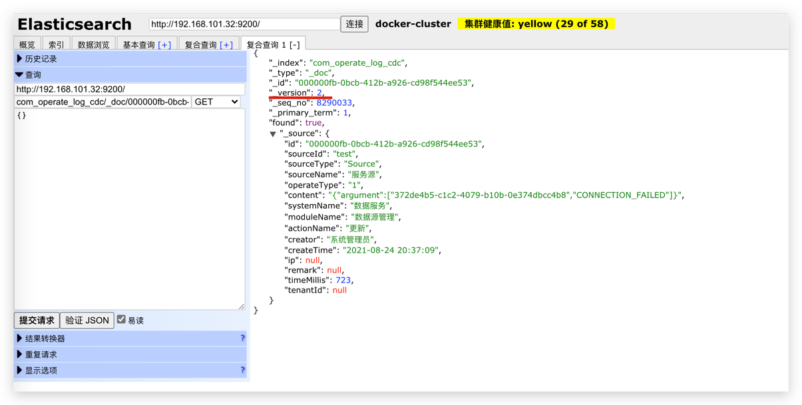
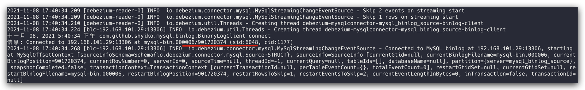

# flink-cdc

> CDC（变化数据捕获）实时同步方案，秒级延迟。

## 原理

> 底层基于 Debezium 进行变化数据捕获，发送给下游（Flink）消费。

利用 [flink-cdc-connectors](https://github.com/ververica/flink-cdc-connectors) 库，基于配置化执行 CDC 任务。

## 实现

### CDC支持数据库

- MySQL（要求版本 5.7+ 且开启 binlog）

  在 MySQL 配置文件（my.cnf）中开启 binlog 配置，其中 binlog_format 需要是 row 。

  ```properties
  # 5.7及以上版本
  server-id=123454
  # 日志文件地址
  log-bin=/var/lib/mysql/mysql-bin
  # 日志格式
  binlog_format=row
  ```

  如果只开启某个库，则通过 binlog_do_db 配置。

  ```properties
  binlog_do_db=数据库1
  binlog_do_db=数据库2
  ...
  ```

- ~~Oracle（支持版本 11、12、19 且开启 archivelog）~~

  检测是否开启 archivelog 。

  ```
  -- Should now "Database log mode: Archive Mode"
  archive log list;
  ```

  **经测试，存在 4 分钟左右延迟。https://github.com/ververica/flink-cdc-connectors/issues/609**

  

  **存在延迟，暂无法生产使用**

### 目标端支持数据库

- MySQL
- PostgreSQL
- SQLServer
- Oracle
- 达梦
- ElasticSearch

### 思路

类似 DataX 的思想，提供一个配置（描述这个任务），程序解析配置执行 CDC 任务。

## 部署

### local模式

> 即 Flink local 模式，通过重写 local 模式源码，使之支持 checkpoint 恢复机制，重启后可恢复之间的状态。

打包：

```shell
mvn clean package -DskipTests

# target/flink-cdc-1.0.0-SNAPSHOT.jar
# mv target/flink-cdc-1.0.0-SNAPSHOT.jar /some/path/flink-cdc.jar
```

使用：

```shell
java -Xms1g -Xmx1g -jar /some/path/flink-cdc.jar /some/path/job.yaml
```

### 集群

暂未处理。

## CDC任务

> 即 CDC 任务配置示例。

### MySQL-MySQL

监听 MySQL 变化，写入 MySQL

```yaml
# 任务名称
name: flink-cdc-mysql-mysql
# 并行度，默认为1
parallelism: 1
# 检查点，重启可恢复
checkpoint:
  dir: /Users/xuanbo/temp/checkpoint
  # 每分钟checkpoint
  interval: 60000
  # 10分钟超时
  timeout: 600000
# 启动时是否从检查点恢复之前的状态
savepoint:
  enabled: true
# 任务定义
pipeline:
  # 创建mysql cdc监听，该表的定义参考flink sql
  - |
    CREATE TABLE t_user (
      id INT,
      name STRING,
      username STRING,
      email STRING,
      password STRING,
      created_at TIMESTAMP(3),
      PRIMARY KEY (id) NOT ENFORCED
    ) WITH (
      'connector' = 'mysql-cdc',
      'hostname' = 'localhost',
      'port' = '3306',
      'username' = 'root',
      'password' = '123456',
      'database-name' = 'test',
      'table-name' = 'user'
    )
  # 创建目标端
  - |
    CREATE TABLE t_user_copy (
      id INT,
      name STRING,
      username STRING,
      email STRING,
      password STRING,
      created_at TIMESTAMP(3),
      PRIMARY KEY (id) NOT ENFORCED
    ) WITH (
       'connector' = 'jdbc',
       'url' = 'jdbc:mysql://localhost:3306/test?serverTimezone=Asia/Shanghai&allowMultiQueries=true&autoReconnect=true&failOverReadOnly=false&useUnicode=true&characterEncoding=utf8',
       'username' = 'root',
       'password' = '123456',
       'table-name' = 'user_copy'
    )
  # 触发任务，将源端写入目标端
  - INSERT INTO t_user_copy SELECT id, name, username, email, password, created_at FROM t_user
```

### MySQL-SQLServer

监听 MySQL 变化，写入 SQLServer

```yaml
name: flink-cdc-mysql-sqlserver
parallelism: 1
checkpoint:r
  dir: /Users/xuanbo/temp/checkpoint
  interval: 60000
  timeout: 600000
savepoint:
  enabled: true
pipeline:
  - |
    CREATE TABLE t_user (
      id INT,
      name STRING,
      username STRING,
      email STRING,
      password STRING,
      created_at TIMESTAMP(3),
      PRIMARY KEY (id) NOT ENFORCED
    ) WITH (
      'connector' = 'mysql-cdc',
      'hostname' = 'localhost',
      'port' = '3306',
      'username' = 'root',
      'password' = '123456',
      'database-name' = 'test',
      'table-name' = 'user'
    )
  - |
    CREATE TABLE t_user_copy (
      id INT,
      name STRING,
      username STRING,
      email STRING,
      password STRING,
      created_at TIMESTAMP(3),
      PRIMARY KEY (id) NOT ENFORCED
    ) WITH (
       'connector' = 'jdbc',
       'url' = 'jdbc:sqlserver://192.168.101.22:1433;DatabaseName=testdb',
       'username' = 'sa',
       'password' = 'yourStrong(!)Password',
       'table-name' = 'user_cdc'
    )
  - INSERT INTO t_user_copy SELECT id, name, username, email, password, created_at FROM t_user
```

### MySQL-ElasticSearch

监听 MySQL 变化，写入 ElasticSearch

```yaml
name: flink-cdc-mysql-elasticsearch
parallelism: 1
checkpoint:
  dir: /Users/xuanbo/temp/checkpoint
  interval: 60000
  timeout: 600000
savepoint:
  enabled: true
pipeline:
  - |
    CREATE TABLE t_user (
      id INT,
      name STRING,
      username STRING,
      email STRING,
      password STRING,
      created_at TIMESTAMP(3),
      PRIMARY KEY (id) NOT ENFORCED
    ) WITH (
      'connector' = 'mysql-cdc',
      'hostname' = 'localhost',
      'port' = '3306',
      'username' = 'root',
      'password' = '123456',
      'database-name' = 'test',
      'table-name' = 'user'
    )
  - |
    CREATE TABLE t_user_copy (
      id INT,
      name STRING,
      username STRING,
      email STRING,
      password STRING,
      created_at TIMESTAMP(3),
      PRIMARY KEY (id) NOT ENFORCED
    ) WITH (
       'connector' = 'elasticsearch-7',
       'hosts' = 'http://192.168.101.32:9200',
       'username' = 'root',
       'password' = '123456',
       'index' = 'user_cdc'
    )
  - INSERT INTO t_user_copy SELECT id, name, username, email, password, created_at FROM t_user
```

### MySQL-KAFKA

监听 MySQL 变化，写入 Kafka 。再供下游消费写入目标端。

```yaml
name: flink-cdc-mysql-kafka
parallelism: 1
checkpoint:
  dir: /Users/xuanbo/temp/checkpoint
  interval: 60000
  timeout: 600000
savepoint:
  enabled: true
pipeline:
  - |
    CREATE TABLE t_user (
      id INT,
      name STRING,
      username STRING,
      email STRING,
      password STRING,
      created_at TIMESTAMP(3),
      PRIMARY KEY (id) NOT ENFORCED
    ) WITH (
      'connector' = 'mysql-cdc',
      'hostname' = 'localhost',
      'port' = '3306',
      'username' = 'root',
      'password' = '123456',
      'database-name' = 'test',
      'table-name' = 'user'
    )
  - |
    CREATE TABLE t_user_copy (
      id INT,
      name STRING,
      username STRING,
      email STRING,
      password STRING,
      created_at TIMESTAMP(3)
    ) WITH (
       'connector' = 'kafka',
       'topic' = 'cdc_user',
       'properties.bootstrap.servers' = '192.168.101.32:9092',
       'properties.group.id' = 'flink-cdc-mysql-kafka',
       'scan.startup.mode' = 'earliest-offset',
       'format' = 'debezium-json'
    )
  - INSERT INTO t_user_copy SELECT id, name, username, email, password, created_at FROM t_user
```

注意：

- format 为 debezium-json

  写入 kafka 的数据格式如下：

  ```json
  {"before":null,"after":{"id":7,"name":"李四","username":"lisi","email":"lisi@mail.com","password":"123456","created_at":"2021-11-03 10:31:47"},"op":"c"}
  ```

### Oracle-ElasticSearch

监听 MySQL 变化，写入 ElasticSearch

```yaml
name: flink-cdc-oracle-elasticsearch
parallelism: 1
checkpoint:
  dir: /Users/xuanbo/temp/checkpoint
  interval: 60000
  timeout: 600000
savepoint:
  enabled: true
pipeline:
  - |
    CREATE TABLE t_user (
      id INT,
      name STRING,
      username STRING,
      email STRING,
      password STRING,
      created_at TIMESTAMP(3),
      PRIMARY KEY (id) NOT ENFORCED
    ) WITH (
      'connector' = 'oracle-cdc',
      'hostname' = 'localhost',
      'port' = '1521',
      'username' = 'flinkuser',
      'password' = 'flinkpw',
      'database-name' = 'XE',
      'schema-name' = 'flinkuser',  
      'table-name' = 'user'
    )
  - |
    CREATE TABLE t_user_copy (
      id INT,
      name STRING,
      username STRING,
      email STRING,
      password STRING,
      created_at TIMESTAMP(3),
      PRIMARY KEY (id) NOT ENFORCED
    ) WITH (
       'connector' = 'elasticsearch-7',
       'hosts' = 'http://192.168.101.32:9200',
       'username' = 'root',
       'password' = '123456',
       'index' = 'user_cdc'
    )
  - INSERT INTO t_user_copy SELECT id, name, username, email, password, created_at FROM t_user
```

## 批处理

也支持批处理

### MySQL-MySQL

```yaml
# 任务名称
name: flink-cdc-mysql-mysql
# 并行度，默认为1
parallelism: 1
# 检查点，重启可恢复
checkpoint:
  dir: /Users/xuanbo/temp/checkpoint
  # 每分钟checkpoint
  interval: 60000
  # 10分钟超时
  timeout: 600000
# 启动时是否从检查点恢复之前的状态，批处理重启后不需要恢复
savepoint:
  enabled: false
# 任务定义
pipeline:
  # 创建mysql读（注意 connector 为 jdbc ，则就是批处理，跑完后停止），该表的定义参考flink sql
  - |
    CREATE TABLE t_user (
      id INT,
      name STRING,
      username STRING,
      email STRING,
      password STRING,
      created_at TIMESTAMP(3),
      PRIMARY KEY (id) NOT ENFORCED
    ) WITH (
       'connector' = 'jdbc',
       'url' = 'jdbc:mysql://localhost:3306/test?serverTimezone=Asia/Shanghai&allowMultiQueries=true&autoReconnect=true&failOverReadOnly=false&useUnicode=true&characterEncoding=utf8',
       'username' = 'root',
       'password' = '123456',
       'table-name' = 'user'
    )
  # 创建目标端
  - |
    CREATE TABLE t_user_copy (
      id INT,
      name STRING,
      username STRING,
      email STRING,
      password STRING,
      created_at TIMESTAMP(3),
      PRIMARY KEY (id) NOT ENFORCED
    ) WITH (
       'connector' = 'jdbc',
       'url' = 'jdbc:mysql://localhost:3306/test?serverTimezone=Asia/Shanghai&allowMultiQueries=true&autoReconnect=true&failOverReadOnly=false&useUnicode=true&characterEncoding=utf8',
       'username' = 'root',
       'password' = '123456',
       'table-name' = 'user_copy'
    )
  # 触发任务，将源端写入目标端
  - INSERT INTO t_user_copy SELECT id, name, username, email, password, created_at FROM t_user
```

## 测试用例

### MySQL-ElasticSearch

用 DataX 准备基础数据 800w 条：



配置文件：

```yaml
name: flink-cdc-mysql-elasticsearch
parallelism: 1
checkpoint:
  dir: /Users/xuanbo/temp/checkpoint
  interval: 60000
  timeout: 600000
savepoint:
  enabled: true
pipeline:
  - |
    CREATE TABLE t_operate_log (
      id STRING,
      sourceId STRING,
      sourceType STRING,
      sourceName STRING,
      operateType STRING,
      content STRING,
      systemName STRING,
      moduleName STRING,
      actionName STRING,
      creator STRING,
      createTime TIMESTAMP(3),
      ip STRING,
      remark STRING,
      timeMillis INT,
      tenantId STRING,
      PRIMARY KEY (id) NOT ENFORCED
    ) WITH (
      'connector' = 'mysql-cdc',
      'hostname' = '192.168.101.29',
      'port' = '13306',
      'username' = 'root',
      'password' = '123456',
      'database-name' = 'test',
      'table-name' = 'com_operate_log'
    )
  - |
    CREATE TABLE t_operate_log_copy (
      id STRING,
      sourceId STRING,
      sourceType STRING,
      sourceName STRING,
      operateType STRING,
      content STRING,
      systemName STRING,
      moduleName STRING,
      actionName STRING,
      creator STRING,
      createTime TIMESTAMP(3),
      ip STRING,
      remark STRING,
      timeMillis INT,
      tenantId STRING,
      PRIMARY KEY (id) NOT ENFORCED
    ) WITH (
      'connector' = 'elasticsearch-7',
      'hosts' = 'http://192.168.101.32:9200',
      'username' = 'root',
      'password' = '123456',
      'index' = 'com_operate_log_cdc'
    )
  - INSERT INTO t_operate_log_copy SELECT * FROM t_operate_log
```

流程：

- 首先 Flink CDC 会记录当前 binlog 的信息，然后进行全量同步。

  

  

  注意，只有当全量同步完成后，checkpoint 才会有相关的 offset 等记录。如果该过程服务挂了或重启了，下次还是会从头开始，可以理解为该过程是一个事务。

  

  可以发现，只有全量同步完成后 Checkpoint Data Size 才写入了对应的数据。（此后，可通过 Savepoint 进行恢复）

- 全量同步完成后，进行后续的 CDC 处理。

  

  修改表数据后，position 增加

  

  查询 ES 后可以看到数据更新过（version 从 1 到 2）

  

- 重启从 Savepoint 恢复

  

## 平台化

暂未处理。
